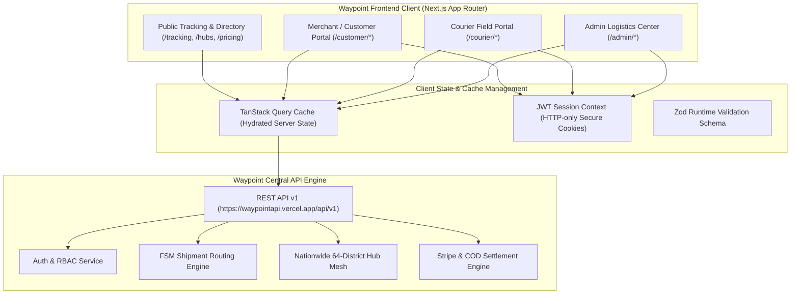

# 🚀 Waypoint — Next-Generation Logistics & Supply Chain Platform

[](https://nextjs.org/)
[](https://react.dev/)
[](https://tailwindcss.com/)
[](https://tanstack.com/query)
[](https://www.typescriptlang.org/)
[](https://ui.shadcn.com/)
[](https://zod.dev/)

---

## 📌 Executive Overview & Purpose

**Waypoint** is an enterprise-grade, high-velocity logistics and parcel delivery frontend engineered specifically to address the unique complexities of digital commerce and nationwide distribution across Bangladesh. 

Built with the Next.js App Router, modern reactive state engines, and a clean domain-driven architecture, Waypoint bridges merchants, hub dispatch operators, regional couriers, and end customers into a single unified operating system. The platform eliminates transit blind spots, automates parcel batching, enforces secure Cash on Delivery (COD) collection handshakes, and provides transparent visibility across all **64 districts** and **8 administrative divisions**.

### The Core Problem Waypoint Solves
- **Fragmented Visibility:** Eliminates disconnected tracking records through a single end-to-end waypoint audit trail from the instant a parcel is booked until final recipient handover.
- **Delivery Discrepancies & Fraud:** Replaces unverifiable delivery claims with cryptographically verified OTP handshakes and strict cash reconciliation checks at the doorstep.
- **Intra-District vs. Inter-District Routing Friction:** Implements an adaptive Finite State Machine (FSM) that intelligently branches between localized hub drops and multi-hop highway linehauls.
- **Slow Merchant Settlement:** Provides automated billing clarity, COD transaction tracking, and transparent fee calculators for high-volume enterprise and boutique social commerce sellers alike.

---

## 🏗️ System Architecture & Workflow



---

## 🌟 Key Features & Capabilities

### 1. Dual-Route Finite State Machine (FSM) Lifecycle
Waypoint models shipments as an immutable 9-state Finite State Machine. Unlike generic linear progress bars, the platform dynamically renders route-aware steppers based on whether the transit route is **LOCAL** (intra-hub) or **INTER_DISTRICT** (linehaul cargo):

```mermaid
flowchart TD
    subgraph LocalFSM ["LOCAL Route (Intra-Hub / Intra-City)"]
        L1[PENDING] --> L2[ASSIGNED]
        L2 --> L3[PICKED_UP]
        L3 --> L4[RECEIVED_AT_ORIGIN_HUB]
        L4 -->|Direct Neighborhood Route| L5[OUT_FOR_DELIVERY]
        L5 --> L6[DELIVERED]
    end

    subgraph InterFSM ["INTER_DISTRICT Route (Multi-Hub Highway Linehaul)"]
        I1[PENDING] --> I2[ASSIGNED]
        I2 --> I3[PICKED_UP]
        I3 --> I4[RECEIVED_AT_ORIGIN_HUB]
        I4 -->|Highway Linehaul Cargo| I5[IN_TRANSIT]
        I5 -->|Regional Terminal Sorting| I6[RECEIVED_AT_DEST_HUB]
        I6 --> I7[OUT_FOR_DELIVERY]
        I7 --> I8[DELIVERED]
    end
```



#### Canonical Shipment Status Breakdown:
| Status Key | Human Label | Badge Presentation | Lifecycle Description |
| :--- | :--- | :--- | :--- |
| `PENDING` | Order Placed | Amber / Secondary | Consignment registered; awaiting courier assignment. Can be cancelled by customer. |
| `ASSIGNED` | Courier Assigned | Blue / Outline | First-mile courier partner assigned for doorstep pickup. |
| `PICKED_UP` | Parcel Collected | Sky / Default | Merchant or sender consignment picked up by rider. |
| `RECEIVED_AT_ORIGIN_HUB` | At Origin Hub | Amber / Muted | Scanned into local distribution hub for barcoding and batching. |
| `IN_TRANSIT` | In Linehaul Transit | Indigo / Accent | Highway freight linehaul moving across divisional borders *(Inter-district only)*. |
| `RECEIVED_AT_DEST_HUB` | At Destination Hub | Purple / Secondary | Received and sorted at recipient's divisional destination terminal. |
| `OUT_FOR_DELIVERY` | Out for Delivery | Orange / Default | Last-mile courier dispatched with 4-digit recipient verification OTP. |
| `DELIVERED` | Delivered | Emerald / Success | Recipient OTP verified and COD collected. Handover terminal state. |
| `CANCELLED` | Cancelled | Red / Destructive | Order terminated with audit reason recorded. Terminal state. |

---

### 2. Comprehensive Role-Based Portals

The frontend enforces strict role-based isolation (`CUSTOMER`, `COURIER`, `ADMIN`) governed by Next.js edge route guards and reactive authentication context.

#### 👤 Customer & Merchant Portal (`/customer`)
- **Interactive KPI Overview:** High-level dashboard showing total spend, parcel volume, in-flight deliveries, delivered percentages, and payment reconciliations.
- **Smart Parcel Booking Engine:** Complete parcel registration supporting parcel dimensions, physical weight, fragile cargo flags, and doorstep pickup scheduling.
- **Flexible Settlement Selection:** Toggle between prepaid digital payment (Stripe checkout session) and automated Cash on Delivery (COD) collection.
- **Consignment Ledger & Live Filtering:** Searchable list with status filters (`PENDING`, `IN_TRANSIT`, `DELIVERED`), real-time tracking quick-links, and one-click invoice generation.
- **Order Cancellation:** Controlled cancellation flow with mandatory audit reason logging prior to courier dispatch.

#### 🛵 Courier Partner Portal (`/courier`)
- **Daily Run-Sheet & Route Batching:** Dynamic list of assigned first-mile pickups and last-mile doorstep deliveries.
- **One-Tap Status Actions:** Semantic state-transition actions (`Pickup Confirmed`, `Dispatched for Delivery`).
- **Secure OTP Doorstep Handshake:** 4-digit numeric verification input ensuring parcels are strictly delivered to authorized recipients.
- **COD Liability Safeguard:** Real-time cash collection prompt enforcing that collected cash amounts match or exceed invoice liabilities before completing delivery.
- **Quick-Dial Recipient Contact:** Direct telephone action triggers with PII masking for safe rider communication.

#### 🛡️ Administrative Logistics Center (`/admin`)
- **Platform-Wide Operations Radar:** Real-time visibility into system-wide transit volume, hub saturation, delivery SLA compliance, and gross logistics throughput.
- **Nationwide Hub Mesh Management:** Full CRUD operations for divisional hubs, gateway sorting centers, cut-off schedule controls, and daily package capacity monitoring.
- **Fleet & Courier Dispatch:** Manual and algorithmic assignment of available field couriers to unassigned consignments.
- **User Governance:** Complete merchant, courier, and administrator directory with ability to audit, suspend, activate, or update user permissions.
- **Reconciliation & CSV Reporting:** Instant export of billing ledgers, COD remittances, and fulfillment audit records.

---

### 3. Public Consignment Tracking & Audit Trail (`/tracking`)
- **Instant Non-Authenticated Lookup:** Instant parcel tracking via tracking identifier (e.g. `WP-DAC-98214`, `WP-CTG-44102`).
- **Chronological Node Audit Feed:** Complete historical log showing date, exact timestamp, hub scan node, responsible dispatch personnel, and checkpoint status.
- **Summary Cards:** Quick snapshot of estimated arrival time, origin & destination terminals, recipient vicinity, package weight, and payment collection method.
- **Copy & Share Capabilities:** One-click tracking link copy, social sharing modal, and printable waybill summary.

---

### 4. Nationwide Hub Network & Directory (`/hubs`)
- **64-District Complete Coverage:** Exhaustive mapping of distribution nodes across all 8 administrative divisions of Bangladesh (*Dhaka, Chittagong, Sylhet, Rajshahi, Khulna, Barishal, Rangpur, Mymensingh*).
- **Gateway Sorting Facilities:** Highlighted central logistics hubs (such as Dhaka Tejgaon Central Gateway and Chittagong Port Terminal) handling heavy cross-divisional freight linehaul.
- **Critical Hub Metadata:** Live display of hub codes (e.g. `HUB-DAC-01`), evening cutoff times (e.g. 9:00 PM), daily sorting capacities, physical addresses, and direct helpline numbers.
- **Division-Based Filter Tabs & Search:** Rapid indexing by district name, division, or hub code.

---

### 5. Instant Rate Calculator & Transparent Pricing (`/pricing`)
- **Dynamic Logistics Calculator:** Instant shipping cost estimation based on origin/destination district selection, actual parcel weight (kg), and delivery speed tier.
- **Transparent Service Tiers:**
  - **Starter / Individual (৳60 intra-city / ৳110 inter-district):** Ideal for social commerce and occasional merchants with weekly COD payouts.
  - **Growth Merchant (৳50 intra-city / ৳95 inter-district):** Built for high-velocity online stores with next-day automated settlement and API integrations.
  - **Enterprise Freight:** Custom high-capacity linehaul with dedicated account managers and volume discount contracts.
- **Zero Hidden Surcharges:** Explicit breakdown of fuel surcharges, COD handling percentages (1%), and complimentary transit insurance up to ৳5,000.

---

### 6. User Profile & Preferences Center (`/profile`, `/settings`)
- **Unified Identity Management:** Edit full name, verify primary email address, manage phone numbers, and inspect assigned account role badges.
- **High-Resolution Avatar Uploads:** Integrated direct-to-cloud image upload pipeline via UploadThing with client-side preview and MIME type validation.
- **Security & Password Management:** Robust password reset and change forms equipped with real-time Zod validation and match confirmation.
- **Appearance & Theme Engine:** System-aware theme switcher with zero-flicker transitions between Light Mode, Dark Mode, and System Preference.
- **Notification & Regional Controls:** Granular toggles for SMS tracking dispatches, email receipts, WhatsApp alerts, and preferred divisional sorting hub.

---

## 🛠️ Technology Stack & Engineering Standards

| Dimension | Technology | Architecture Decision & Rationale |
| :--- | :--- | :--- |
| **Framework** | Next.js 16 (App Router) | Utilizing React 19 Server Components for fast initial page loads and Client Components for rich interactive dashboards. |
| **Data Fetching & Cache** | TanStack Query v5 | Centralized server-state management with structured query keys, automatic cache invalidation, and resilient retry logic. |
| **Form Management** | TanStack React Form & Zod | Strict schema validation, inline field-level errors, and type inference without manual redundant interfaces. |
| **UI Primitive Library** | shadcn/ui & Base UI | Accessible, composable primitives (Dialogs, Cards, Badges, Accordions, Avatars, Buttons) styled with Tailwind CSS. |
| **Styling & Design System** | Tailwind CSS v4 | Strict token-driven design system with canonical scale values (`text-primary`, `bg-muted`, `border-border`) and zero arbitrary classes. |
| **Iconography** | Lucide React & Hugeicons | Modern, crisp iconography for logistics tracking, vehicle dispatch, hub nodes, and security status. |
| **File Upload Pipeline** | UploadThing | Secure, presigned direct-to-storage file uploads for KYC documentation, profile avatars, and delivery proofs. |
| **Authentication & Tokens** | HTTP-Only Cookies & JWT | Token storage managed via secure cookies with client-side JWT hydration and edge route redirection guards. |

---

## 🔒 Security, Safety & Data Integrity Guardrails

1. **Role Boundary Enforcement:** Users authenticated under one role cannot access alternative portals (`/admin`, `/courier`, `/customer`). Unauthenticated sessions attempting to visit protected paths are redirected to `/login?redirect=[path]`.
2. **Strict Bangladeshi Phone Format:** All mobile numbers validated with strict national regex:
   ```regex
   ^01[3-9]\d{8}$
   ```
3. **Personally Identifiable Information (PII) Protection:** Customer recipient phone numbers and precise street locations are masked on public interfaces to protect consignee privacy.
4. **Structured API Envelope:** All client requests communicate with the central API (`https://waypointapi.vercel.app/api/v1`) using a unified response structure:
   ```json
   {
     "success": true,
     "statusCode": 200,
     "message": "Operation completed successfully",
     "data": {}
   }
   ```
5. **No Arbitrary CSS Tokens:** UI adheres strictly to custom Tailwind tokens, ensuring uniform visual hierarchy and zero styling inconsistencies.

---

## 🗺️ Project Directory Structure

```text
src/
├── app/                          # Next.js App Router root
│   ├── (auth)/                   # Authentication routes (/login, /register)
│   ├── about/                    # Platform mission & story
│   ├── api/                      # Next.js API route handlers (UploadThing)
│   ├── careers/                  # Job openings & courier partner applications
│   ├── contact/                  # Enterprise inquiry & support tickets
│   ├── faq/                      # Comprehensive delivery & merchant FAQs
│   ├── hubs/                     # Nationwide 64-district hub directory
│   ├── pricing/                  # Service tiers & instant rate calculator
│   ├── privacy/                  # Privacy policy & data governance
│   ├── profile/                  # Account management & password update
│   ├── services/                 # Express, linehaul & freight solutions
│   ├── settings/                 # Theme, notification & regional preferences
│   ├── terms/                    # Merchant service agreements & SLA
│   ├── tracking/                 # Public consignment tracking & audit feed
│   ├── layout.tsx                # Root layout with providers & global header/footer
│   ├── page.tsx                  # High-conversion landing page
│   ├── providers.tsx             # TanStack Query & Theme provider wrappers
│   └── proxy.ts                  # Edge route protection & RBAC middleware
├── components/
│   ├── common/                   # Shared shell components (Navbar, Footer, Logo, ThemeToggle)
│   └── ui/                       # shadcn/ui design primitives (Button, Card, Badge, Accordion, etc.)
├── features/                     # Domain-driven feature slices
│   ├── auth/                     # Authentication context, JWT cookies, login/register forms & schemas
│   ├── theme/                    # Dynamic theme provider & dark mode switching
│   └── users/                    # Profile management, avatar uploader & password forms
├── hooks/                        # Custom reusable React hooks (useAuth, useTheme)
├── lib/                          # Shared utilities (api, cookies, jwt, query-client, uploadthing, utils)
└── types/                        # Global TypeScript interfaces & domain models
```

---

## 🌐 API Endpoint Reference

The frontend interfaces with the centralized Waypoint REST API at:
```text
https://waypointapi.vercel.app/api/v1
```

### Core API Route Blueprint:
| Domain | Method | Route | Description |
| :--- | :--- | :--- | :--- |
| **Auth** | `POST` | `/auth/login` | Authenticate credentials and receive JWT access token |
| **Auth** | `POST` | `/auth/register` | Register new Customer or Courier account |
| **Auth** | `POST` | `/auth/logout` | Terminate session and invalidate client tokens |
| **Users** | `GET` | `/users/me` | Fetch authenticated user profile & verification status |
| **Users** | `PATCH` | `/users/me` | Update name, phone number, and avatar URL |
| **Users** | `PATCH` | `/users/change-password` | Update current password with confirmation |
| **Shipments** | `GET` | `/shipments/track/:id` | Public consignment tracking and event audit trail |
| **Shipments** | `POST` | `/shipments` | Book new parcel consignment with dimensions & weight |
| **Shipments** | `GET` | `/shipments` | Query paginated shipments with status filters |
| **Shipments** | `POST` | `/shipments/:id/pickup` | Courier confirmation of parcel collection from sender |
| **Shipments** | `POST` | `/shipments/:id/out-for-delivery` | Mark consignment out for last-mile delivery |
| **Shipments** | `POST` | `/shipments/:id/complete-delivery`| Verify recipient 4-digit OTP & record COD collection |
| **Shipments** | `POST` | `/shipments/:id/cancel` | Cancel pending consignment with audit reason |
| **Hubs** | `GET` | `/hubs` | Retrieve full list of 64-district operational hubs |
| **Payments** | `POST` | `/payments/create-checkout-session`| Generate Stripe digital payment checkout session |

---

## 📄 License & Intellectual Property

Waypoint is proprietary software designed for modern logistics operations. All rights reserved.
